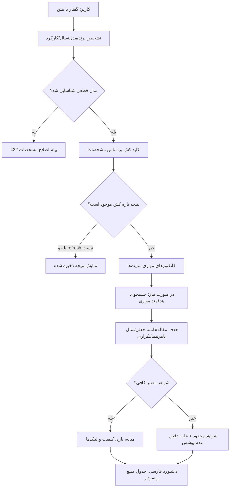

# جریان جست‌وجوی نسخه ۲۳

```mermaid
flowchart TD
  A[کاربر: گفتار یا متن] --> B[تشخیص برند/مدل/سال/کارکرد]
  B --> C{مدل قطعی شناسایی شد؟}
  C -->|نه| D[پیام اصلاح مشخصات 422]
  C -->|بله| E[کلید کش براساس مشخصات]
  E --> F{نتیجه تازه کش موجود است؟}
  F -->|بله و refresh نیست| G[نمایش نتیجه ذخیره شده]
  F -->|خیر| H[کانکتورهای موازی سایت‌ها]
  H --> I[در صورت نیاز: جستجوی هدفمند موازی]
  I --> J[حذف مقاله/دامنه جعلی/سال نامرتبط/تکراری]
  J --> K{شواهد معتبر کافی؟}
  K -->|بله| L[میانه، بازه، کیفیت و لینک‌ها]
  K -->|خیر| M[شواهد محدود + علت دقیق عدم پوشش]
  L --> N[داشبورد فارسی، جدول منبع و نمودار]
  M --> N
```

**یادآوری:** این دیاگرام معماری کد و آزمون‌های آفلاین است؛ موفقیت جست‌وجوی زنده در همه منابع هنوز تأیید نشده است.
